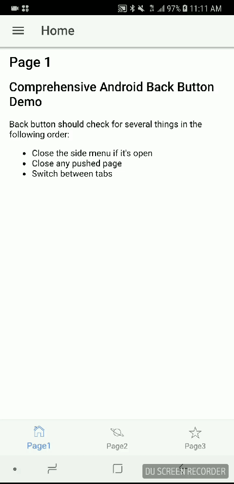

# Ionic Android Back Button

Comprehensive Android Back Button Demo

Performing the following checks:

* Close the side menu if it's open
* Close any pushed page
* Switch between tabs




## Getting Started

```
npm install
ionic cordova platform add android
ionic cordova run android
```

## Built With

* [Ionic](https://ionicframework.com/) - The Ionic Framework

## License

This project is licensed under the MIT License - see the [LICENSE.md](LICENSE.md) file for details
